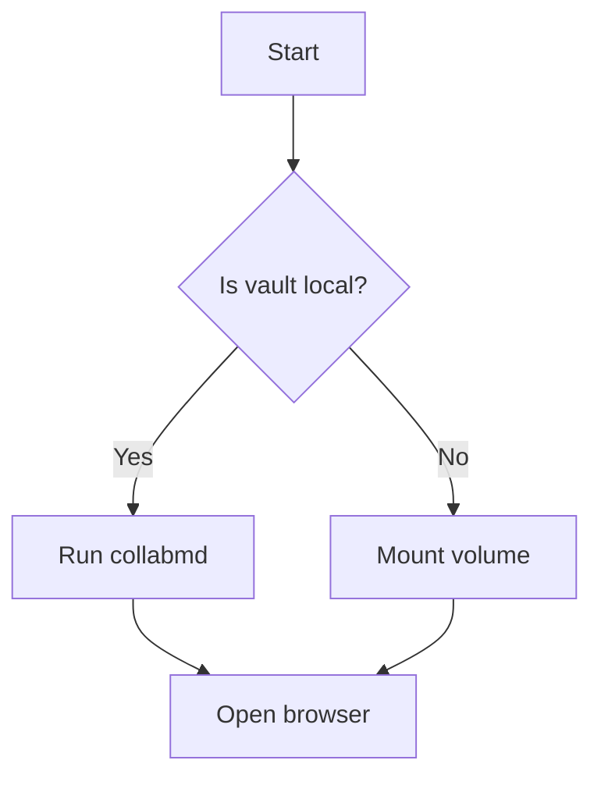

CollabMD renders diagrams alongside your Markdown without any plugins or build steps. Three diagram formats are supported: Mermaid, PlantUML, and Excalidraw.

<CardGroup cols={2}>
  <Card title="Mermaid" icon="diagram-project">
    Inline fences in Markdown or standalone `.mmd` / `.mermaid` files
  </Card>
  <Card title="PlantUML" icon="sitemap">
    Inline blocks or standalone `.puml` / `.plantuml` files with server-side SVG rendering
  </Card>
  <Card title="Excalidraw" icon="pen-ruler">
    Standalone `.excalidraw` files open as a full whiteboard
  </Card>
</CardGroup>

## Mermaid

Mermaid diagrams can appear in two places:

**Inline in a Markdown file** — use a fenced code block with the `mermaid` language tag:

````markdown

````

The live preview renders the diagram automatically as you type.

**Standalone diagram files** — create a file with a `.mmd` or `.mermaid` extension. CollabMD opens it in side-by-side mode: the editor on the left, the rendered diagram on the right. Changes in the editor update the preview in real time.

## PlantUML

PlantUML diagrams also work inline and as standalone files:

- **Inline**: wrap your PlantUML source in a fenced block with the `plantuml` language tag inside a Markdown file
- **Standalone**: create a `.puml` or `.plantuml` file and open it for side-by-side editing

Rendering is server-side: CollabMD sends the diagram source to a PlantUML server and embeds the returned SVG in the preview.

<Note>
  PlantUML rendering is server-side and controlled by the `PLANTUML_SERVER_URL` environment variable. The default points to the public `https://www.plantuml.com/plantuml` service. Set `PLANTUML_SERVER_URL` to a self-hosted PlantUML instance if you do not want diagram source sent to the public service.
</Note>

### Offline PlantUML with local Docker

Pass the `--local-plantuml` flag to start a bundled `plantuml/plantuml-server:jetty` container automatically and point `PLANTUML_SERVER_URL` at it:

```bash
collabmd ~/my-vault --local-plantuml
```

You can also bring up the local service independently:

```bash
npm run plantuml:up
```

The included `docker-compose.yml` uses the local PlantUML service by default, so `docker compose up` avoids the public renderer entirely.

## Excalidraw

Files with a `.excalidraw` extension open in direct preview mode: the full Excalidraw whiteboard is embedded in the CollabMD workspace.

This is useful for freeform diagrams and sketches that live alongside your Markdown notes.

<Note>
  Excalidraw files currently do not support source-anchored comments. Comment threads are available for Markdown, Mermaid, and PlantUML files only.
</Note>
